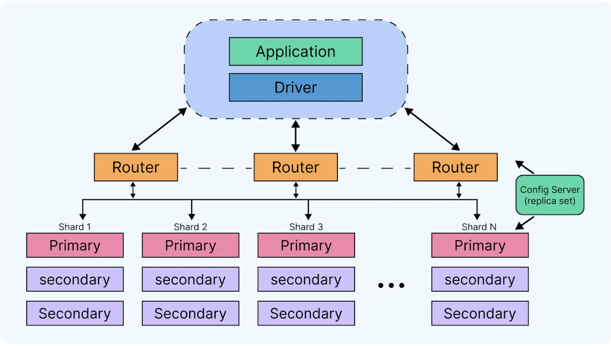
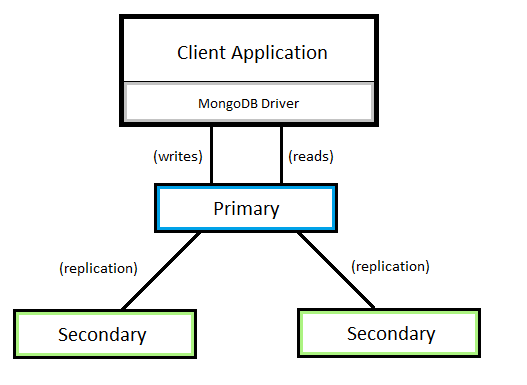
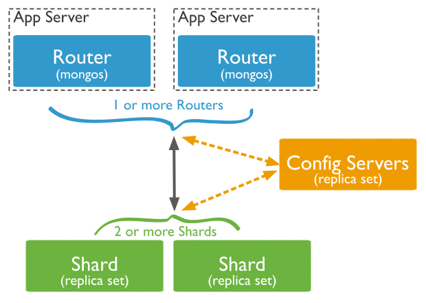

# MongoDB Explained

## What is MongoDB?

MongoDB is open source **NoSQL database** that uses a document-oriented data model. It stores data in flexible, JSON-like documents called BSON (Binary JSON). Unlike relational databases, MongoDB does not require a predefined schema, which makes it ideal for handling large volumes of unstructured or semi-structured data. It is designed for scalability, high performance, and ease of development.

**Key Features and concepts**:

**Document Oriented**:
Data is stored in flexible, JSON-like documents, which can vary in structure, allowing for easier handling of diverse data types. 

**Scalability and High Availability**:
MongoDB is designed for horizontal scaling (adding more machines) and replication, enabling high availability and performance for large-scale applications. 

**Flexible Schema**:
MongoDB's schema is dynamic, meaning you don't need a predefined structure for your data. This allows for easier iteration and adaptation as your application evolves. 

**BSON**:
MongoDB uses BSON (Binary JSON) to store data, which is a binary representation of JSON that can accommodate more data types than standard JSON. 

---

## What are Collections and Documents?
- **Document**: The basic unit of data in MongoDB. A document is similar to a JSON object, containing field-value pairs. Documents in the same collection can have different fields and structures. The `_id` field is a unique identifier for each document and is automatically generated by MongoDB.  
Example:
```json
{
  "name": "Tariq",
  "age": 30,
  "skills": ["JavaScript", "Python"]
}
```


- **Collection**: A container for documents, similar to a table in a relational database. Collections group related documents together. A database can contain multiple collections. Unlike relational databases, MongoDB collections don’t enforce a strict schema, allowing for flexibility in document structure.


---

## MongoDB Architecture
The structure of MongoDB consists of a schema-less model that manages data in dynamic and complex structures. Components such as the server, shard, and storage engine operate seamlessly to perform data operations.




---

## What are Replica Sets?
A **replica set** is a group of MongoDB servers that maintain the same data set to ensure high availability and redundancy.

### How do they work?
- One node is **primary**, others are **secondaries**
- All writes and reads (by default) go to the primary
- If the primary fails, an election occurs and a secondary becomes the new primary



### Advantages
- High availability
- Automatic failover
- Data redundancy

### Disadvantages
- Increased complexity
- Risk of stale reads on secondaries
- Delays in replication under high load

---

## What is Sharding?

Sharding is a method of distributing data across multiple machines (shards) to handle large datasets and high throughput. It allows for horizontal scaling, meaning you can add more machines to your cluster to increase storage capacity and performance as needed. 


### How does it work in MongoDB specifically?
1. Data is partitioned based on a **shard key**
2. Each chunk of data is sent to a shard (a replica set)
3. `mongos` is the query router that directs requests to the correct shard



### Advantages
- Linear scalability for large datasets
- Load balancing for high throughput
- Enables geographically distributed data

### Disadvantages
- Requires careful selection of shard key
- Complex to manage and monitor
- Potential for uneven data distribution

---

## MongoDB Use Cases

### 1. Content Management Systems (CMS)
Forbes adopted MongoDB Atlas to modernise their outdated, on-premises CMS, which was difficult to maintain and lacked flexibility. Moving to a cloud-based solution gave them a faster, more scalable platform that supports rapid development and seamless feature integration. MongoDB’s flexible data model allowed their teams to cut build times from 25 minutes to just 9.

This upgrade improved both developer productivity and reader experience, with faster page rendering and simpler maintenance. Forbes now plans to implement Atlas Search to further enhance search performance and continue delivering innovation at speed.

[Ref] (https://www.mongodb.com/solutions/customer-case-studies/forbes#challenge)
---

### 2. Internet of Things (IoT)
Bosch uses MongoDB to manage and process complex IoT data in real time. Its flexible schema and efficient querying make it ideal for high-volume sensor data, which often varies in structure.

A key use case is Bosch IoT Insights, a platform that collects data from tools used in aircraft manufacturing. It monitors torque and angle values, alerting operators when they’re off spec, improving safety and compliance. Bosch also uses MongoDB to analyze data from car engine control units (ECUs), helping engineers understand real-world usage and refine product designs based on actual user behavior.

[Ref] (https://www.mongodb.com/solutions/use-cases/internet-of-things)
---
# 🗃️ Types of NoSQL Databases

NoSQL databases are designed for flexibility, scalability, and high performance. They are generally categorised into four main types:

---

## 1. 📄 Document Databases

- Store data as structured documents (usually JSON or BSON).
- Schema-less: each document can have a different structure.
- Optimised for hierarchical and semi-structured data.

**Examples:**
- MongoDB
- CouchDB
- Amazon DocumentDB

**Use Cases:**
- Content management systems
- User profiles
- Product catalogues

---

## 2. 🔑 Key-Value Stores

- Store data as key–value pairs.
- Extremely fast for lookups using a unique key.
- Simple structure, limited querying capabilities.

**Examples:**
- Redis
- DynamoDB
- Riak

**Use Cases:**
- Caching
- Session storage
- Real-time recommendations

---

## 3. 📊 Column-Family Stores

- Store data in columns rather than rows.
- Great for large-scale analytics and data warehousing.
- Data is grouped into column families.

**Examples:**
- Apache Cassandra
- HBase
- ScyllaDB

**Use Cases:**
- Time-series data
- Business intelligence
- IoT data collection

---

## 4. 🧠 Graph Databases

- Use nodes and edges to represent and store data.
- Efficient at handling complex relationships and traversals.

**Examples:**
- Neo4j
- ArangoDB
- Amazon Neptune

**Use Cases:**
- Social networks
- Fraud detection
- Recommendation engines

---

## 📌 Summary Table

| Type               | Structure            | Best For                        | Examples               |
|--------------------|----------------------|----------------------------------|------------------------|
| Document Database  | JSON-like documents  | Flexible schema data             | MongoDB, CouchDB       |
| Key-Value Store    | Key-value pairs      | Fast key-based retrieval         | Redis, DynamoDB        |
| Column Store       | Columns              | Analytics, large datasets        | Cassandra, HBase       |
| Graph Database     | Nodes and Edges      | Complex relationships            | Neo4j, ArangoDB        |

---

# 🧮 Normalisation vs Denormalisation

When designing a database, especially in relational systems or document-based systems like MongoDB, choosing between **normalisation** and **denormalisation** affects performance, storage, and complexity.

---

## 📘 Normalisation

**Definition:**  
The process of organising data to reduce redundancy and improve data integrity by dividing data into related tables or documents.

### ✅ Advantages
- Reduces data duplication
- Ensures consistency (single source of truth)
- Easier to maintain and update

### ❌ Disadvantages
- Requires complex joins or references to access full data
- Slower reads due to multiple queries

### 💡 Example: Normalised Relational Model

**Users table:**

| user_id | name   |
|---------|--------|
| 1       | Tariq  |

**Orders table:**

| order_id | user_id | product |
|----------|---------|---------|
| 101      | 1       | Book    |

---

## 📕 Denormalisation

**Definition:**  
The process of combining data into a single table or document to improve read performance at the cost of some redundancy.

### ✅ Advantages
- Faster read operations
- Simpler queries (no joins)
- Better performance in distributed systems

### ❌ Disadvantages
- More data redundancy
- Risk of inconsistency
- Harder to maintain if data updates frequently

### 💡 Example: Denormalised Document (MongoDB Style)

```json
{
  "user_id": 1,
  "name": "Tariq",
  "orders": [
    {
      "order_id": 101,
      "product": "Book"
    }
  ]
}
```

## 🆚 Key Differences

| Feature           | Normalisation                   | Denormalisation              |
|-------------------|--------------------------------|-----------------------------|
| Data Redundancy    | Minimal                        | High                        |
| Read Performance   | Slower (requires joins)        | Faster (less querying needed)|
| Write Performance  | Faster                        | Slower (due to duplicates)  |
| Storage Usage      | More efficient                | Uses more space             |
| Use Case          | OLTP (transactional systems)   | OLAP (analytical systems)   |

---

# 📊 Database Scaling

Database scaling refers to techniques used to handle increased load and data volume by improving database performance and capacity.

---

## 1. Vertical Scaling (Scale-Up)

- Increasing the resources (CPU, RAM, storage) of a single database server.
- Simpler to implement.
- Limited by hardware capacity.

### ✅ Advantages
- Easier to manage.
- No changes needed in application architecture.

### ❌ Disadvantages
- Expensive hardware upgrades.
- Single point of failure.
- Limited scalability.

---

## 2. Horizontal Scaling (Scale-Out)

- Adding more database servers to distribute load.
- Data is partitioned or replicated across multiple servers.

### Types:
- **Sharding:** Splitting data across multiple machines based on a shard key.
- **Replication:** Copying data across servers for redundancy and read scaling.

### ✅ Advantages
- Can handle very large datasets.
- Improves fault tolerance.
- Better performance for high read/write loads.

### ❌ Disadvantages
- More complex setup and maintenance.
- Potential consistency challenges.

---

## 3. Scaling in NoSQL Databases

- Many NoSQL databases are designed to scale horizontally by default.
- Use sharding and replication natively (e.g., MongoDB, Cassandra).

---

## Summary Table

| Scaling Type       | Method                       | Pros                        | Cons                           |
|--------------------|------------------------------|-----------------------------|--------------------------------|
| Vertical Scaling    | Upgrade single server         | Simpler, easy to manage     | Hardware limits, costly        |
| Horizontal Scaling  | Add more servers (shard/replicate) | Scales large datasets, fault tolerant | Complex, potential consistency issues |

---

# 🌐 Graph Databases

Graph databases are designed to store and manage data where relationships between entities are as important as the data itself. They use graph structures with **nodes**, **edges**, and **properties** to represent and query data.

---

## Key Concepts

- **Node:** Represents an entity (e.g., person, product, place).
- **Edge (Relationship):** Connects two nodes and defines their relationship.
- **Property:** Key-value pairs that describe nodes or edges.

---

## Features

- Optimised for handling complex relationships.
- Fast traversal of connected data.
- Schema-flexible and highly expressive for relationship queries.

---

## Use Cases

- Social networks (friends, followers)
- Recommendation systems (products, users)
- Fraud detection (link analysis)
- Knowledge graphs

---

## Examples of Graph Databases

- Neo4j
- Amazon Neptune
- ArangoDB
- JanusGraph

---

## Sample Query (Cypher language for Neo4j)

```cypher
CREATE (t:Person {name: "Tariq"})
CREATE (m:Skill {name: "MongoDB"})
CREATE (t)-[:KNOWS]->(m)

MATCH (p:Person)-[:KNOWS]->(s:Skill)
RETURN p.name, s.name
```

## Advantages

- Intuitive modelling of relationships.
- Efficient for deep link analysis.
- Flexible schema evolution.

## Disadvantages

- Not ideal for simple key-value or tabular data.
- Can be less performant for large-scale transactional workloads.
---

# 🔗 Relationships in MongoDB

MongoDB is a NoSQL document database that handles relationships differently than relational databases. Instead of joins, MongoDB uses two main approaches to model relationships:

---

## 1. Embedded Documents (Denormalisation)

- Related data is stored **within** a single document.
- Useful for one-to-few or one-to-many relationships where related data is accessed together.
- Improves read performance by retrieving related data in a single query.
- Can lead to larger documents.

### Example:

```json
{
  "user_id": 1,
  "name": "Tariq",
  "orders": [
    {
      "order_id": 101,
      "product": "Book"
    },
    {
      "order_id": 102,
      "product": "Pen"
    }
  ]
}
```

---

## 2. References (Normalization)

- Store related data in **separate collections**.
- Documents reference each other using ObjectIds.
- Useful for many-to-many relationships or when related data grows large.
- Requires multiple queries or application-side joins.

### Example:

**Users collection:**

```json
{
  "_id": "60c72b2f9af1f23d8c123456",
  "name": "Tariq"
}
```

**Orders collection:**

```json
{
  "order_id": 101,
  "user_id": "60c72b2f9af1f23d8c123456",
  "product": "Book"
}
```

---

## Summary

| Relationship Type   | Description                               | Use Case                      |
|---------------------|-------------------------------------------|------------------------------|
| Embedded Documents   | Related data stored inside a document     | One-to-few or one-to-many    |
| References          | Related data stored in separate collections | Many-to-many or large datasets |

---

# 🐚 Common Mongosh Commands

MongoDB Shell (mongosh) is the interactive JavaScript shell interface to MongoDB.

---

## Connecting to MongoDB

```bash
mongosh "mongodb+srv://cluster0.mongodb.net/myFirstDatabase" --username myUsername
```

---

## Basic Commands

| Command                   | Description                          |
|---------------------------|------------------------------------|
| `show dbs`                | Lists all databases                 |
| `use <database>`          | Switch to a specific database       |
| `show collections`        | Lists collections in the current DB |
| `db`                      | Displays the current database       |
| `db.createCollection(name)` | Creates a new collection          |
| `db.collection.drop()`    | Drops a collection                  |
| `db.collection.stats()`   | Shows stats of a collection         |

---

## CRUD Operations

### Insert Documents

```js
db.users.insertOne({ name: "Tariq", age: 30 })
db.users.insertMany([{ name: "Alice" }, { name: "Bob" }])
```

### Find Documents

```js
db.users.find()                  // Find all documents
db.users.find({ name: "Tariq" }) // Find documents matching query
db.users.find().pretty()        // Pretty-print results
```

### Update Documents

```js
db.users.updateOne(
  { name: "Tariq" },
  { $set: { age: 31 } }
)
```

### Delete Documents

```js
db.users.deleteOne({ name: "Bob" })
db.users.deleteMany({ age: { $lt: 25 } })
```

---

## Indexing

```js
db.users.createIndex({ name: 1 }) // Create ascending index on name
```

---

## Aggregation Example

```js
db.orders.aggregate([
  { $match: { status: "completed" } },
  { $group: { _id: "$customerId", total: { $sum: "$amount" } } }
])
```

---

## Exit Mongosh

```bash
exit
```

---

# 📊 MongoDB Aggregation: `aggregate()` and `_id` Field

Aggregation operations process data records and return computed results. The aggregation pipeline is a framework for data aggregation modeled on the concept of data processing pipelines.

---

## The `aggregate()` Method

- Used to perform aggregation operations on collections.
- Accepts an array of stages that process documents.

### Basic Syntax:

```js
db.collection.aggregate([
  { <stage1> },
  { <stage2> },
  ...
])
```

---

## The `_id` Field in Aggregation

- `_id` is a special field used to group documents in the `$group` stage.
- It defines the key for grouping.

### Example:

Grouping orders by customer ID and calculating total amount per customer:

```js
db.orders.aggregate([
  {
    $group: {
      _id: "$customerId",
      totalAmount: { $sum: "$amount" }
    }
  }
])
```

- Here, `_id` is set to `$customerId`, so documents are grouped by customer.
- The result will have one document per unique customerId with the total amount.

---

## Notes

- `_id` can be any expression or a composite key (object with multiple fields).
- If you want to group all documents together, use `_id: null`.

---

# 🔍 Querying in MongoDB

Querying is how you retrieve data from MongoDB collections using various operators and expressions.

---

## Basic Find Query

```js
db.collection.find({}) // Returns all documents
db.collection.find({ name: "Tariq" }) // Returns documents where name is "Tariq"
```

| Operator | Description              | Example                            |
| -------- | ------------------------ | ---------------------------------- |
| `$eq`    | Equal to                 | `{ age: { $eq: 30 } }`             |
| `$ne`    | Not equal to             | `{ age: { $ne: 30 } }`             |
| `$gt`    | Greater than             | `{ age: { $gt: 25 } }`             |
| `$gte`   | Greater than or equal to | `{ age: { $gte: 25 } }`            |
| `$lt`    | Less than                | `{ age: { $lt: 30 } }`             |
| `$lte`   | Less than or equal to    | `{ age: { $lte: 30 } }`            |
| `$in`    | In array of values       | `{ status: { $in: ["A", "B"] } }`  |
| `$nin`   | Not in array of values   | `{ status: { $nin: ["A", "B"] } }` |

| Operator | Description | Example                                             |
| -------- | ----------- | --------------------------------------------------- |
| `$and`   | Logical AND | `{ $and: [{ age: { $gt: 25 } }, { status: "A" }] }` |
| `$or`    | Logical OR  | `{ $or: [{ age: { $lt: 25 } }, { status: "A" }] }`  |
| `$not`   | Logical NOT | `{ age: { $not: { $gt: 25 } } }`                    |
| `$nor`   | Logical NOR | `{ $nor: [{ age: 25 }, { status: "A" }] }`          |

### Projection
Select which fields to return:

```
db.collection.find({}, { name: 1, age: 1, _id: 0 }) // Returns only name and age, excludes _id
```
### Sorting Results
```
db.collection.find().sort({ age: -1 }) // Sort by age descending
```
### Limiting and Skipping

```
db.collection.find().limit(5) // Return only 5 documents
db.collection.find().skip(10) // Skip first 10 documents

```
