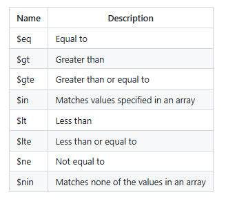

# MongoDB Comparison Operators 

## `$eq` – Equal
**Definition**: Matches documents where the value of a field equals the specified value.

**Example**:
```js
db.characters.find({ height: { $eq: 200 } }, { name: 1, height: 1 })
```

This query returns characters whose height is exactly `200`.

---

## `$gt` – Greater Than
**Definition**: Selects documents where the value of the specified field is **greater than** the given value.

**Example**:
```js
db.characters.find({ height: { $gt: 200 } }, { name: 1, height: 1 })
```

This returns characters taller than `200`.

---

## `$gte` – Greater Than or Equal
**Definition**: Selects documents where the value is **greater than or equal to** the specified value.

**Example**:
```js
db.characters.find({ height: { $gte: 200 } }, { name: 1, height: 1 })
```

This returns characters whose height is `200` or more.

---

## `$in` – In Array
**Definition**: Matches any of the values specified in an array.

**Example**:
```js
db.characters.find({ height: { $in: [200, 264, 228] } }, { name: 1, height: 1 })
```

This finds characters whose height is either `200`, `264`, or `228`.

---

## `$lt` – Less Than
**Definition**: Selects documents where the field value is **less than** the specified value.

**Example**:
```js
db.characters.find({ height: { $lt: 200 } }, { name: 1, height: 1 })
```

This returns characters shorter than `200`.

---

## `$lte` – Less Than or Equal
**Definition**: Matches documents where the field value is **less than or equal to** the specified value.

**Example**:
```js
db.characters.find({ height: { $lte: 200 } }, { name: 1, height: 1 })
```

This finds characters who are `200` or shorter.

---

## `$ne` – Not Equal
**Definition**: Selects documents where the field value is **not equal** to the specified value. Also includes documents where the field does not exist.

**Example**:
```js
db.characters.find({ height: { $ne: 200 } }, { name: 1, height: 1 })
```

This finds characters whose height is **not** `200`.

---

## `$nin` – Not In Array
**Definition**: Matches documents where the field value is **not in** the specified array, or the field is missing.

**Example**:
```js
db.characters.find({ height: { $nin: [200, 264, 228] } }, { name: 1, height: 1 })
```

**Explanation**: This excludes characters with heights of `200`, `264`, or `228`.

---


